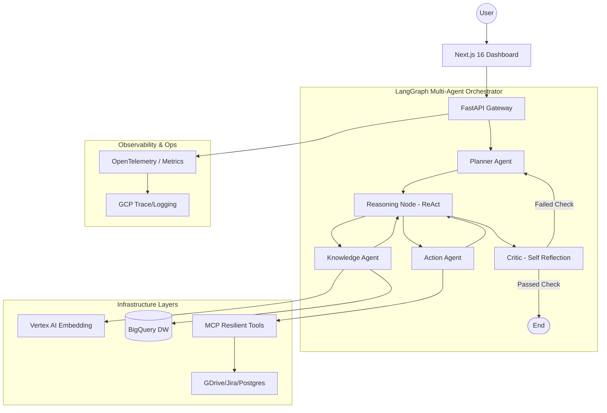

# AgentBridge: Enterprise GenAI Deployment Platform

> **Architecting the Connective Tissue between Frontier AI and Production Reality.**

AgentBridge is an elite, production-grade deployment platform designed to solve the "Last Mile" problem of enterprise AI. It transforms disconnected data silos into a production-hardened, multi-agent ecosystem.

**Inspired by the Google Cloud Forward Deployed Engineer (GenAI) mission**, this platform demonstrates the technical rigor, architectural depth, and operational focus required to move GenAI from prototype to measurable enterprise ROI.

---

## 🏗 Advanced Orchestration Patterns

### 1. Hierarchical ReAct Loop
AgentBridge implements a **Hierarchical ReAct (Reason+Act)** pattern using **LangGraph**. The system doesn't just call tools; it utilizes a dedicated **Reasoning Node** that recursively analyzes the results of each action, deciding whether to gather more information via **MCP tools**, execute a business side-effect, or proceed to final criticism.

### 2. Self-Reflection & Criticism
Every agentic response is routed through a **Critic Agent** (Self-Reflection node). This node performs a semantic **Groundedness Check** against retrieved context. If the response is identified as low-quality or potentially hallucinated, the system triggers a **Hierarchical Correction**, sending the task back to the **Planner** for plan adjustment.

### 3. Dual-Layer State Persistence
As documented in [ADR 002](./docs/adr/002-dual-layer-state-management.md), the system employs a high-performance **Redis** layer for hot workflow checkpointing and a **PostgreSQL** layer for permanent cold analytical storage, audit trails, and multi-tenant metadata.

---

## 🛠 Operationalizing GenAI (The FDE Way)

### 📈 Real-Time ROI Metrics
AgentBridge captures the "auxiliary practical concerns" essential for production deployment:
- **Tokens/sec & TTFT:** Granular latency tracking for Gemini 1.5 Pro.
- **Cost-per-Session:** Real-time USD estimation based on token consumption.
- **Trace Explorer:** OpenTelemetry-instrumented lifecycles from the user UI to the deep model nodes.

### 🛡 Production Hardening & Resiliency
- **Circuit Breakers:** Native implementation to prevent cascading failures in legacy customer APIs (Jira, GitHub).
- **MCP Servers:** Secure, isolated tool execution environment following the **Model Context Protocol**.
- **Data Readiness:** A proactive diagnostic layer that identifies "data blockers" (schema drift, metadata gaps) before they impact AI accuracy.

### 🧪 ML Ops & Drift Detection
- **Model Registry:** Tracking production vs. staging versions for **XGBoost** (Ticket Routing) and **PyTorch** (Priority Prediction).
- **Drift Detection:** Statistical monitoring (KL-Divergence) for covariate shifts in live inference batches.

---

## 🏛 Technical Architecture

---

## 👨‍💻 Author
**Jainam** - [GitHub](https://github.com/Jainam1673)

*This project is a definitive proof-of-competency for architecting enterprise-grade GenAI systems. It demonstrates the ability to not just build AI, but to deploy, secure, and operate it within the constraints of real-world enterprise infrastructure.*
