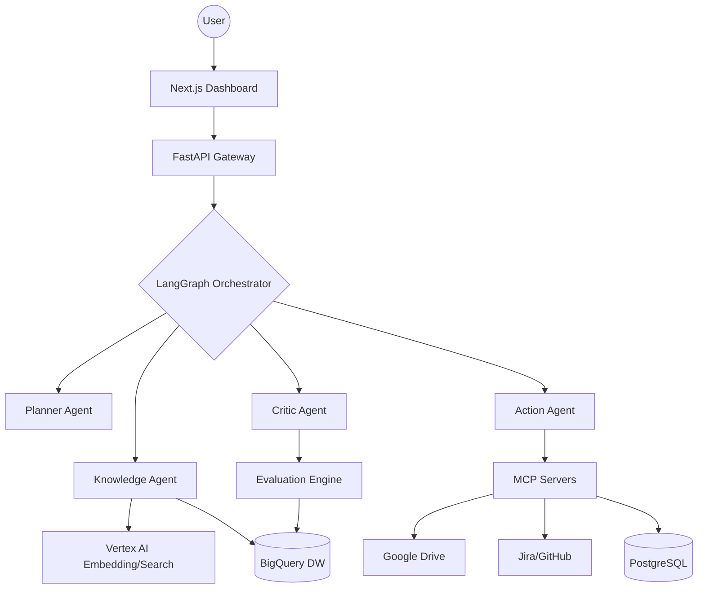

# AgentBridge: Enterprise GenAI Deployment Platform

> **Architecting the Connective Tissue between Frontier AI and Production Reality.**

[](https://cloud.google.com/)
[](https://langchain-ai.github.io/langgraph/)
[](https://www.python.org/)
[](https://nextjs.org/)
[](https://github.com/Jainam1673/AgentBridge)

---

## 🎯 Executive Summary
AgentBridge is a high-fidelity deployment platform designed for the **Google Cloud Forward Deployed Engineer (GenAI)** persona. It solves the "Last Mile" problem of enterprise AI by transforming disconnected data silos (Google Drive, GitHub, Jira, PostgreSQL) into a production-hardened, multi-agent ecosystem. 

Unlike toy demos, AgentBridge manages the **auxiliary practical concerns**—data readiness, circuit-broken tool execution, granular cost-tracing, and self-reflecting agent loops—required to move GenAI from "cool prototype" to "enterprise ROI."

---

## 🚀 Key Value Propositions

### 🧠 Hierarchical Multi-Agent Orchestration
Leveraging **LangGraph**, AgentBridge employs a specialized agent collective:
- **Planner:** State-aware task decomposition.
- **Knowledge Agent:** Multi-hop RAG across Vector Stores and BigQuery.
- **Action Agent:** Side-effect execution via MCP servers.
- **Critic Agent:** Self-reflection loop for groundedness and safety validation.

### 🛡 Production-Grade "Connective Tissue"
- **Resiliency Patterns:** Native implementation of **Circuit Breakers** and **Exponential Backoff** to protect legacy customer infrastructure during agentic tool-calling.
- **Secure Tooling (MCP):** Implementation of the **Model Context Protocol** for isolated, auditable, and tool-based system access.
- **Enterprise Auth:** RBAC-enforced workflows integrated with Google OAuth 2.0.

### 📊 AI Readiness & Observability
- **Data Readiness Engine:** A diagnostic ML layer that identifies "blockers" (metadata gaps, stale docs, schema drift) before deployment.
- **Granular LLM Metrics:** Real-time tracking of **Tokens/sec**, **TTFT (Time-to-First-Token)**, and **Token-based Cost Estimation** per session.
- **Full-Stack Tracing:** OpenTelemetry-instrumented request lifecycles exported to GCP Cloud Trace.

---

## 🏛 Technical Architecture

### System Flow


### Deep-Stack Integration
| Layer | Technologies | Google Cloud Alignment |
| :--- | :--- | :--- |
| **Orchestration** | LangGraph, LangChain, Redis | Vertex AI Agentic Workflows |
| **Storage** | PostgreSQL, BigQuery, GCS | Cloud SQL & BigQuery Warehouse |
| **ML/AI** | PyTorch, XGBoost, Gemini 1.5 Pro | Vertex AI Model Garden & Training |
| **Observability** | OpenTelemetry, Prometheus | Cloud Monitoring & Logging |
| **Compute** | Docker, Cloud Run | Serverless Scalability |

---

## 🛠 Features for the FDE Persona

### 1. The "Blocker Remover" (Data Readiness)
AgentBridge identifies why a customer *isn't* ready for AI. The Readiness Dashboard provides a scored assessment of schema health and metadata completeness, generating a roadmap for data remediation.

### 2. High-Performance Evaluation (Eval)
A dedicated pipeline tracks **Groundedness**, **Safety**, and **Relevance** using LLM-as-a-judge patterns, allowing for historical benchmarking and regression testing of agentic prompts.

### 3. Cost & Latency Optimization
Granular visibility into token consumption and TTFT allows FDEs to optimize for both end-user experience (latency) and organizational budget (cost-per-request).

---

## 📋 Getting Started

### Prerequisites
- **Google Cloud Platform:** Project with Vertex AI, BigQuery, and Cloud Run APIs enabled.
- **Runtime:** Python 3.13+ (`uv`), Bun 1.1+, Terraform 1.5+.

### Local Deployment (Production Simulation)
1. **Clone & Setup:**
   ```bash
   git clone https://github.com/Jainam1673/AgentBridge.git
   cd AgentBridge
   ```

2. **Initialize Infrastructure (Dry-Run):**
   ```bash
   cd infra
   terraform init
   terraform plan -var="project_id=YOUR_PROJECT_ID"
   ```

3. **Spin up Services:**
   ```bash
   docker-compose up --build
   ```

4. **Seed Multi-Tenant Simulation:**
   ```bash
   docker-compose exec backend python src/seed.py
   ```

---

## 👨‍💻 Author
**Jainam** - [GitHub](https://github.com/Jainam1673)

*This project is a definitive proof-of-competency for architecting enterprise-grade GenAI systems. It demonstrates the ability to not just build AI, but to deploy, secure, and operate it within the constraints of real-world enterprise infrastructure.*
